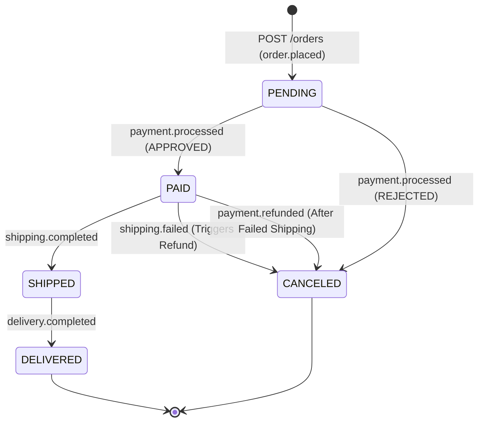
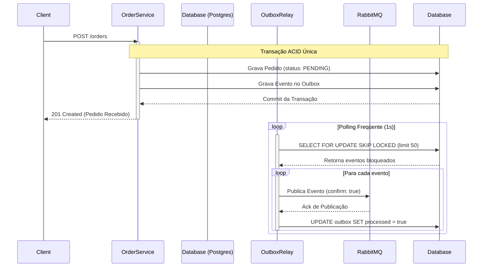

# 📦 Sistema de Processamento de Pedidos (Saga Choreography + Outbox Pattern)

Um ecossistema de micro-serviços orientado a eventos, estruturado sob o padrão de **Saga Coreografada** para gerenciar a consistência eventual distribuída, aliado ao padrão **Transactional Outbox** no serviço de pedidos para garantir a entrega confiável de mensagens (*At-Least-Once*).

Este repositório é um laboratório pragmático focado em resolver os principais desafios de arquiteturas orientadas a eventos em sistemas reais de produção: **Dual-Write, concorrência, retentativas resilientes, idempotência e compensação distribuída.**

---

## 🧠 Filosofia Arquitetural

* **Coreografia sobre Orquestração:** Em vez de um orquestrador centralizado (Saga Orchestrator) que cria um ponto único de falha e acoplamento temporal, este sistema utiliza **Saga Coreografada**. Cada serviço reage de forma autônoma aos eventos publicados no RabbitMQ, executando sua regra de negócio e emitindo novos eventos.
* **Design for Failure (Projeto para Falhas):** Quedas de rede, instabilidades em gateways de pagamento externos e indisponibilidade de banco de dados são tratadas como normais. O sistema implementa **Políticas de Retry com Backoff e Dead Letter Queues (DLQs)** na infraestrutura de mensageria, protegendo os workers.
* **Garantia de Entrega At-Least-Once:** Utilizando o **Transactional Outbox Pattern**, eliminamos o risco de persistir dados no banco e falhar ao publicar no RabbitMQ (ou vice-versa). O banco de dados PostgreSQL é a única fonte de verdade transacional.

---

## 🏗️ Serviços e Fluxo do Sistema

O monorepo é dividido em serviços específicos com responsabilidades bem delimitadas:

1. **Order Service (Node.js + Fastify + Drizzle ORM + PostgreSQL):**
   * **Responsabilidade:** Domínio de Pedidos, API Gateway HTTP inicial e gerador da Máquina de Estados do pedido.
   * **Fluxo:** Recebe a requisição HTTP `POST /orders`, inicia uma transação no PostgreSQL para persistir o pedido com status `PENDING` e registra a intenção do evento na tabela `outbox`. O `OutboxRelay` lê essa tabela assincronamente e publica o evento `order.placed`.
2. **Payment Service (Go + PostgreSQL):**
   * **Responsabilidade:** Worker assíncrono e de alta performance de cobrança.
   * **Fluxo:** Consome `order.placed`, valida a idempotência e realiza o processamento de pagamento simulado. Publica `payment.processed` com o status final (`APPROVED` ou `REJECTED`).
3. **Shipping Service (Planejado / Docker Stub):**
   * **Responsabilidade:** Domínio de entrega e logística.
   * **Fluxo:** Consome `payment.processed` (quando aprovado), gera a ordem de despacho e publica `shipping.completed` ou `shipping.failed` (se o endereço for inválido, por exemplo).
4. **Notification Service (Planejado / Docker Stub):**
   * **Responsabilidade:** Comunicação com o cliente.
   * **Fluxo:** Ouve os eventos do ciclo de vida do pedido para simular o disparo de emails/SMS transacionais.

---

## ⚙️ Padrão Saga Coreografada (Choreography Saga)

Em sistemas distribuídos, transações ACID globais (como 2PC) não escalam e criam forte acoplamento. A Saga gerencia o fluxo de transações locais e passos compensatórios.

### Máquina de Estados do Pedido

O ciclo de vida de um pedido transiciona baseado nas respostas assíncronas dos serviços periféricos:



### 1. Fluxo de Sucesso (Happy Path)

1. **Order Service**: Cria o pedido (`PENDING`) $\rightarrow$ grava no Outbox $\rightarrow$ publica `order.placed`.
2. **Payment Service**: Consome `order.placed` $\rightarrow$ debita o cliente com sucesso $\rightarrow$ publica `payment.processed` (com payload contendo `status: APPROVED`).
3. **Order Service** & **Shipping Service**:
   * O **Order Service** consome `payment.processed` (APPROVED) $\rightarrow$ atualiza o status do pedido para `PAID`.
   * O **Shipping Service** consome `payment.processed` (APPROVED) $\rightarrow$ processa a entrega $\rightarrow$ publica `shipping.completed`.
4. **Order Service**: Consome `shipping.completed` $\rightarrow$ atualiza o status do pedido para `SHIPPED` (Fim da Saga).

### 2. Estratégia de Compensação (Rollback Assíncrono)

Se um passo intermediário da Saga falhar, **ações compensatórias inversas** devem ser disparadas para garantir a consistência final.

* **Exemplo: Falha no Envio (Endereço Inválido)**
  1. O pagamento foi processado com sucesso e o pedido está como `PAID`.
  2. O **Shipping Service** tenta criar a etiqueta de postagem, mas falha (endereço fora da área de entrega).
  3. O **Shipping Service** publica o evento `shipping.failed`.
  4. **Ações Compensatórias Reativas**:
     * O **Payment Service** consome `shipping.failed` $\rightarrow$ inicia o estorno (refund) do pagamento $\rightarrow$ publica `payment.refunded`.
     * O **Order Service** consome `shipping.failed` ou `payment.refunded` $\rightarrow$ transiciona o pedido para `CANCELED` com justificativa de falha de entrega.

> [!IMPORTANT]
> **A Regra de Ouro da Compensação é a Idempotência.**
> A rede pode falhar e enviar o evento de compensação (`shipping.failed`) múltiplas vezes para o Payment Service. O serviço de pagamento deve registrar estornos efetuados e ignorar solicitações repetidas para o mesmo ID, garantindo que o dinheiro não seja devolvido duas vezes.

---

## 📬 Padrão Transactional Outbox

Para evitar problemas de **Dual-Write** (onde salvamos o pedido no banco, mas a rede cai antes de enviarmos para o RabbitMQ), implementamos o **Transactional Outbox**:



### Otimização Concorrente: `FOR UPDATE SKIP LOCKED`

Para permitir escalabilidade horizontal (rodar múltiplas réplicas do `order-service` sem que elas dupliquem envios ou criem gargalos de concorrência), o `OutboxRelay` utiliza travamento pessimista otimizado:

```typescript
const pendingEvents = await tx
  .select()
  .from(schema.outbox)
  .where(eq(schema.outbox.processed, false))
  .orderBy(asc(schema.outbox.createdAt))
  .limit(50)
  .for("update", { skipLocked: true }); // Ignora linhas já bloqueadas por outras réplicas
```

---

## 🐇 Topologia de Mensageria (RabbitMQ)

Configuramos uma única **Topic Exchange** denominada `orders`. As chaves de roteamento permitem rotear dados de forma flexível e inteligente:

| Exchange | Tipo | Routing Key | Fila (Queue) | Fila de Falhas (DLQ) | Consumidor |
| :--- | :--- | :--- | :--- | :--- | :--- |
| `orders` | `topic` | `order.placed` | `payment.process` | `payment.process.dlq` | Payment Service |
| `orders` | `topic` | `payment.processed` | `order.events` | `order.events.dlq` | Order Service |
| `orders` | `topic` | `shipping.completed` | `order.events` | `order.events.dlq` | Order Service |
| `orders` | `topic` | `shipping.failed` | `payment.compensate` | `payment.compensate.dlq` | Payment Service (Estorno) |
| `orders` | `topic` | `shipping.failed` | `order.events` | `order.events.dlq` | Order Service (Cancelamento) |
| `orders` | `topic` | `payment.refunded` | `order.events` | `order.events.dlq` | Order Service (Cancelamento) |
| `orders` | `topic` | `*.*` | `notification.send` | `notification.dlq` | Notification Service |

---

## 🛡️ Resiliência & Tolerância a Falhas

### 1. Estratégias de Retentativa e Descarte (Retry, Backoff e DLQ)

O tratamento de falhas difere conforme a criticidade e dependência de cada consumidor:

* **Payment Service (Exponential Backoff):** Em caso de falhas transientes em sistemas terceiros, o serviço de pagamento não faz `sleep` no código. Ele joga a mensagem para uma exchange de retentativa que usa o tempo de vida da mensagem (TTL) no RabbitMQ. A mensagem "espera" nas filas (ex: `5s`, `15s`) e, ao expirar, cai de volta na fila principal. Falhas excessivas a enviam para a `payment.process.dlq`.
* **Order Service (Fast-Fail):** Sendo um atualizador passivo de status focado no banco local, ele não exige backoffs complexos. Se um evento de domínio chegar malformado (ex: sem `orderId`) ou ocorrer uma falha não mitigável no banco, ele rejeita a mensagem prontamente (`ConsumerStatus.DROP`), que é roteada pelo RabbitMQ para a DLQ direta `order.events.dlq` configurada no ato da criação da fila.

### 2. Idempotência Rigorosa

Tanto na API quanto nos Workers, cada mensagem contém um identificador único de pedido ou transação.

* **Payment Service**: Salva a transação vinculada ao `order_id`. Se reprocessado, ele rejeita a criação do pagamento e reenvia o evento de sucesso original.
* **Order Service**: Ao receber eventos de atualização de status, ele garante transições válidas de status na base de dados para evitar reversão acidental do fluxo.

### 3. Graceful Shutdown

O encerramento limpo da aplicação intercepta sinais do sistema operacional (`SIGINT`, `SIGTERM`), fecha os canais de consumo do RabbitMQ, encerra o processamento das mensagens que já estão na memória com segurança e encerra as conexões.

---

## 🚀 Como Rodar o Projeto

### Pré-requisitos

* Docker e Docker Compose instalados.
* Node.js 20+ (para rodar os serviços JS).
* Go 1.22+ (para rodar o worker de pagamentos).

### Execução

1. Suba os containers de infraestrutura (PostgreSQL e RabbitMQ):

   ```bash
   docker compose up -d
   ```

2. Painéis disponíveis:
   * **RabbitMQ Management**: `http://localhost:15672` (Login: `guest` / `guest`)
   * **Postgres Database**: Porta local `5432` (Login: `postgres` / `postgres`)

3. Para executar as migrations e rodar o `order-service`:

```bash
   cd services/order-service
   pnpm install
   pnpm run db:generate
   pnpm run db:push
   pnpm run dev
```

4.Para rodar os testes:

```bash
   pnpm run test             # Testes unitários
   pnpm run test:integration # Testes de integração E2E com Testcontainers
```
