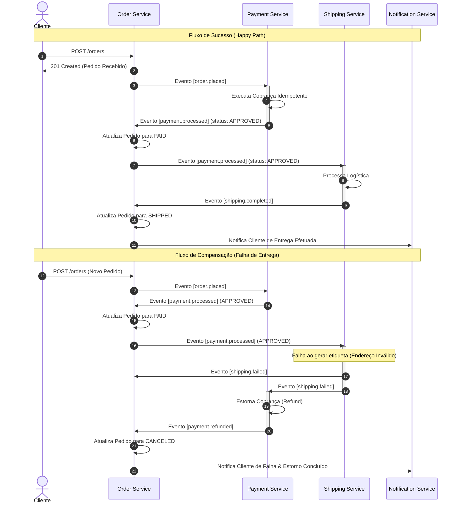

# Product Requirement Document (PRD) & Especificação Técnica

## Sistema de Processamento de Pedidos Distribuído Resiliente

---

## 1. Visão Geral do Produto

O objetivo deste sistema é orquestrar o ciclo de vida de pedidos de ponta a ponta (Criação, Pagamento, Despacho e Notificação) de maneira assíncrona, tolerante a falhas e altamente disponível.

Dado que os sistemas operam de forma distribuída em rede, o produto foca na consistência eventual, garantindo que nenhum pedido fique em estado inconsistente (ex: cobrado mas não entregue sem estorno correspondente) e que a comunicação entre serviços seja resiliente contra instabilidades temporárias de hardware e de APIs terceiras.

---

## 2. Requisitos Funcionais (FR)

| ID | Requisito Funcional | Descrição |
| :--- | :--- | :--- |
| **FR-01** | **Criação de Pedidos** | O cliente deve poder submeter a intenção de compra via API HTTP, recebendo confirmação instantânea de "Pedido Recebido". |
| **FR-02** | **Pagamento Assíncrono** | O processamento do pagamento deve ocorrer em segundo plano (assíncrono), sem bloquear a thread principal do cliente HTTP. |
| **FR-03** | **Máquina de Estados de Pedidos** | O status do pedido deve evoluir conforme o ciclo de vida transita: `PENDING`, `PAID`, `SHIPPED`, `DELIVERED`, `CANCELED`. |
| **FR-04** | **Despacho Automatizado** | Após a confirmação de pagamento com sucesso, o sistema deve requisitar de forma automatizada o envio/despacho do produto. |
| **FR-05** | **Compensação Automatizada** | Se o despacho falhar por qualquer motivo logístico (ex: endereço inexistente), o sistema deve estornar o valor cobrado do cartão de crédito. |
| **FR-06** | **Notificação do Cliente** | O cliente final deve receber notificações de alteração de estado relevantes (ex: Pagamento Aprovado, Envio Confirmado, Compra Cancelada com Reembolso). |

---

## 3. Requisitos Não-Funcionais (NFR)

### NFR-01: Entrega Confiável (*At-Least-Once*)

Nenhuma mensagem/evento de negócio pode ser perdida no trânsito devido a falhas de rede. O sistema deve persistir a mensagem em banco de dados relacional transacional (Postgres) antes do envio para o Message Broker (RabbitMQ).

### NFR-02: Garantia de Idempotência

Todos os consumidores do sistema (Workers) devem ser projetados para processar a mesma mensagem múltiplas vezes sem corromper o estado do banco de dados ou duplicar transações financeiras (ex: dupla cobrança).

### NFR-03: Tolerância a Falhas Temporárias (Resiliência)

Falhas em chamadas de HTTP de Gateways de Pagamento parceiros ou sistemas de entrega devem ser tratadas de forma resiliente, aplicando retentativas não-bloqueantes com aumento exponencial de tempo (Backoff).

### NFR-04: Graceful Shutdown

Em cenários de atualização de versão ou desligamento de servidores, os workers em execução devem finalizar as mensagens que estão processando ativamente antes de fechar os canais, evitando a perda de mensagens no meio da execução.

---

## 4. Detalhamento Arquitetural: Saga Coreografada (Choreography Saga)

A coordenação transacional entre múltiplos micro-serviços utiliza o padrão Saga Coreografada. Em vez de uma orquestração centralizada (Saga Orchestrator), cada serviço age como um agente autônomo baseado em eventos publicados no barramento.

### Desenho de Sequência das Saga Transitions



### Especificação dos Estados e Gatilhos

1. **`PENDING`**:
   * *Gatilho*: Cadastro do pedido via REST API.
   * *Ação*: Persiste o estado do pedido no banco de dados e insere o evento de publicação `order.placed` na tabela de outbox sob a mesma transação ACID.
2. **`PAID`**:
   * *Gatilho*: Recebimento de evento `payment.processed` com status `APPROVED`.
   * *Ação*: Atualiza o status do pedido na base de dados para permitir o faturamento subsequente.
3. **`SHIPPED`**:
   * *Gatilho*: Recebimento de evento `shipping.completed` vindo do Shipping Service.
   * *Ação*: Marca o pedido como enviado.
4. **`DELIVERED`**:
   * *Gatilho*: Confirmação de entrega final (ex: via carrier).
   * *Ação*: Marca o pedido como concluído.
5. **`CANCELED`**:
   * *Gatilho*: Recebimento de `payment.processed` com status `REJECTED` OU recebimento de `shipping.failed` ou `payment.refunded`.
   * *Ação*: Transição de finalização com cancelamento do pedido.

---

## 5. Especificação Técnica do Transactional Outbox Pattern

Para garantir a confiabilidade *At-Least-Once* de saída dos eventos e evitar Dual-Write, o `order-service` não publica mensagens diretamente no RabbitMQ a partir de seus casos de uso de domínio.

### A Estrutura da Tabela no Postgres

```sql
CREATE TABLE outbox (
    id UUID PRIMARY KEY,
    aggregate_type VARCHAR(50) NOT NULL,
    aggregate_id VARCHAR(100) NOT NULL,
    event_type VARCHAR(100) NOT NULL,
    payload JSONB NOT NULL,
    created_at TIMESTAMP WITH TIME ZONE DEFAULT NOW() NOT NULL,
    processed BOOLEAN DEFAULT FALSE NOT NULL,
    processed_at TIMESTAMP WITH TIME ZONE
);

CREATE INDEX idx_outbox_unprocessed
ON outbox(created_at)
WHERE processed = FALSE;
```

### Mecanismo do Relay Daemon (Outbox Relay)

* **Intervalo**: A cada `1000ms`, o daemon acorda em cada réplica da aplicação.
* **Lock pessimista concorrente**: Para impedir concorrência entre réplicas e evitar a duplicação no envio de mensagens, a query SQL usa a técnica `FOR UPDATE SKIP LOCKED`.
* **Fluxo de Transação do Relay**:
  1. Abre transação no Postgres.
  2. Executa a query tipada Drizzle:

     ```typescript
     const pending = await tx
       .select()
       .from(outbox)
       .where(eq(outbox.processed, false))
       .orderBy(asc(outbox.createdAt))
       .limit(50)
       .for('update', { skipLocked: true });
     ```

  3. Para cada mensagem:
     * Envia a mensagem ao RabbitMQ.
     * Aguarda o **Publish Confirmation (Ack)** do broker RabbitMQ.
  4. Atualiza o status de processamento da mensagem no Postgres para `processed = true`.
  5. Commita a transação (liberando os locks).

> [!CAUTION]
> **Tratamento de Erros Críticos no Relay**
> Se qualquer envio de mensagem ao RabbitMQ falhar no passo 3 (ex: conexão perdida), o daemon **lança o erro para fora e aborta toda a transação**. Isso causa o rollback do lote inteiro no Postgres, preservando os locks temporariamente e liberando-os para re-processamento no próximo segundo. Isso garante que nenhum evento seja marcado como processado sem o devido recebimento confirmado pelo Message Broker.

---

## 6. Desenho de Resiliência e Rede de Retentativas no RabbitMQ

Em vez de bloquear threads com retentativas recursivas síncronas (`sleep`/`backoff` no worker do Go ou Node), utilizamos uma infraestrutura assíncrona baseada em filas de espera no RabbitMQ.

```text
                    +------------------------+
                    |    Exchange: orders    |
                    +-----------+------------+
                                |
                   Routing Key: | order.placed
                                v
                    +------------------------+
                    | Queue: payment.process |  <---+
                    +-----------+------------+      |
                                |                   |
               Process falhou   | (instabilidade)   | TTL expirado
                                v                   |
                    +------------------------+      |
                    | Exchange: orders.retry |      |
                    +-----------+------------+      |
                                |                   |
                    Routing Key:| retry.1           |
                                v                   |
                  +----------------------------+    |
                  | Queue: payment.process.w5s |----+
                  |       (TTL: 5000ms)        |
                  +----------------------------+
```

### Configurações de Retry Exponencial (Workers Externos)

Quando uma falha recuperável (Timeout da API externa, banco de dados travado) ocorre em workers que dependem de integrações terceiras (ex: **Payment Service**), a mensagem é direcionada com uma chave de roteamento apropriada para o canal de retentativas:

1. **Tentativa 1**: Fila `payment.process.wait.5s` (TTL: 5s, Dead Letter Exchange: `orders`, Dead Letter Routing Key: `order.placed`).
2. **Tentativa 2**: Fila `payment.process.wait.15s` (TTL: 15s, Dead Letter Exchange: `orders`, Dead Letter Routing Key: `order.placed`).
3. **Tentativa 3**: Fila `payment.process.wait.45s` (TTL: 45s, Dead Letter Exchange: `orders`, Dead Letter Routing Key: `order.placed`).
4. **Tentativas Excedidas**: Direciona definitivamente para `payment.process.dlq` para intervenção manual.

### Estratégia "Fast-Fail" para Atualizações de Domínio (Order Service)

Para consumidores cujo único propósito é atualizar o estado no próprio banco de dados local (como o **Order Service** na fila `order.events`), a topologia não utiliza Backoff Exponencial para evitar complexidade desnecessária.

1. **Mensagens Malformadas ou Falhas Fatais**: A mensagem sofre descarte sumário (`ConsumerStatus.DROP`) que aciona o `Reject` do RabbitMQ.
2. **Dead Letter Exchange Automática**: A fila principal (`order.events`) é parametrizada com os argumentos `x-dead-letter-exchange: ""` e `x-dead-letter-routing-key: "order.events.dlq"`. Mensagens rejeitadas migram instantaneamente para a DLQ.

---

## 7. Telemetria, Rastreabilidade e Logs em Produção

Com a Saga distribuída de forma assíncrona, rastrear um pedido se torna complexo sem uma estratégia unificada de rastreabilidade (Tracing).

### Correlação de Mensagens (Correlation ID)

Toda mensagem iniciada pelo `Order Service` deve possuir nos seus metadados (headers AMQP) um identificador universal:

* `x-correlation-id`: UUIDv4 que acompanha toda a cadeia de execução.
* Toda vez que o `Payment Service` ou o `Shipping Service` emitirem um novo evento subsequente, eles **devem copiar** o `x-correlation-id` da mensagem de origem e repassá-lo ao cabeçalho do novo evento gerado.

### Formato de Log Recomendado

Logs devem ser estruturados em JSON para coleta em agregadores de logs (ex: Elasticsearch, Splunk, Datadog):

```json
{
  "timestamp": "2026-06-19T17:40:00Z",
  "level": "INFO",
  "service": "payment-service",
  "correlation_id": "8b5f3a1d-720c-482a-9e1b-3f2d2427a1b3",
  "order_id": "186604e6-688a-48dd-b2ad-60848962fdc7",
  "message": "Payment processed successfully for customer cus_991823",
  "duration_ms": 322
}
```

---

## 8. Recomendações e Boas Práticas para o Ambiente de Produção

### 1. Limpeza da Tabela Outbox (Housekeeping)

A tabela `outbox` cresce linearmente com a taxa de compras. Em produção, uma tabela muito grande degrada a performance do banco de dados relacional.

* **Recomendação**: Implementar um script executado em segundo plano de forma recorrente (ex: Cron Job) ou através de CDC (Change Data Capture) que expurgue ou envie para banco de arquivamento frio todos os registros com `processed = true` que tenham mais de `7 dias` de existência.

### 2. Monitoramento de DLQs

Uma mensagem cair em uma DLQ significa que o sistema falhou de forma definitiva (ex: dados corrompidos ou falha sistêmica duradoura).

* **Recomendação**: Configurar alarmes de monitoramento (ex: Prometheus + Grafana) alertando caso a métrica `rabbitmq_queue_messages` nas filas `.dlq` seja maior que zero.

### 3. Circuit Breaker em Gateways de Pagamento

Se o Payment Service notar que 10 requisições seguidas para o gateway externo falharam por timeout, ele deve abrir o circuito para evitar sobrecarregar as filas e estressar desnecessariamente a rede.

* **Recomendação**: Implementar uma biblioteca de Circuit Breaker (ex: Hystrix ou similar em Go/TS) configurada para dar fallback com erro transiente controlado direcionado ao canal de retry do RabbitMQ sem derrubar o worker.
